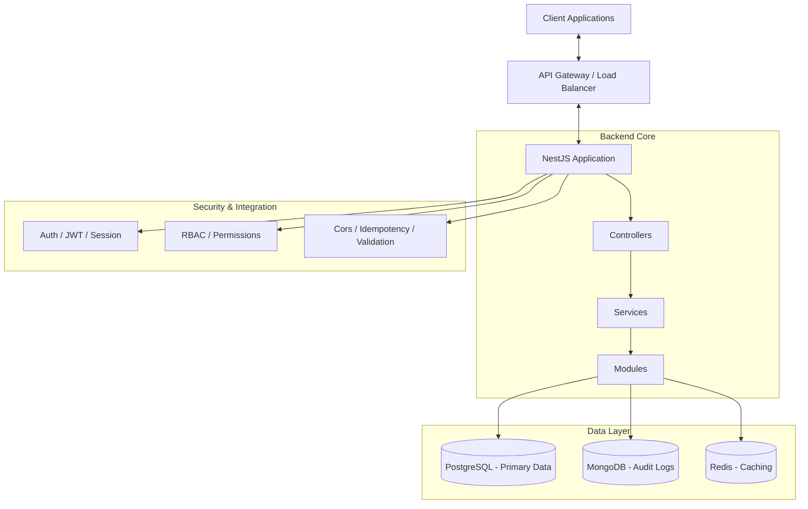

# 🚀 Kasma Mega Platform - Backend API

Kasma Backend is a high-performance, scalable, and modular server-side application built with **NestJS**. It serves as the core infrastructure for the Kasma Mega Platform, providing robust authentication, multi-tenancy support, and complex resource management.

---

## 🏗️ System Architecture

The project follows a **Modular Architecture** pattern, emphasizing separation of concerns and maintainability.

### High-Level Architecture



### Key Pillars

- **NestJS Framework**: Leveraging TypeScript for reliable and maintainable code.
- **Hybrid Storage**:
  - **PostgreSQL**: Structured primary data (Users, Tenants, Roles).
  - **MongoDB**: Flexible data requirements and audit logging.
  - **Redis**: Low-latency caching for performance optimization.
- **Background Processing**: Leveraging **BullMQ** for reliable, asynchronous task execution (Email notifications, stock synchronization, abandoned cart recovery).
- **Multi-Tenancy**: Built-in support for tenant isolation via headers (`X-Tenant-Kasma-Id`).
- **RBAC (Role-Based Access Control)**: Granular permission management across different user roles.

---

## ✨ Core Functionalities

### 🔐 Authentication & Security

- **JWT & Session Based Auth**: Secure user authentication with support for both token-based and session-based flows.
- **Idempotency**: Protects against duplicate requests using specialized interceptors.
- **Global Validation**: Strict input validation using `class-validator` and `ValidationPipe`.
- **CORS Management**: Fine-grained cross-origin resource sharing configuration.

### 🏢 Identity & Access Management (IAM)

- **User Management**: Complete user lifecycle management (Registration, Profile, Credentials).
- **Tenant Management**: Organization/Tenant isolation and specialized access keys.
- **Permission System**: Dynamic role and permission mapping for fine-grained access control.

### 🛒 Ecommerce & Sales Management

- **Product Catalog**: Full CRUD for products with hybrid storage synchronization (Postgres for core, MongoDB for rich content).
- **Categories & Tags**: Hierarchical organization and flexible tagging systems.
- **Sales Operations**: Complete shopping cart, wishlist, and order management workflows.
- **Subscription & Pre-orders**: Support for recurring plans and early product reservations.
- **Advanced Search**: Powerful filtering by search terms, categories, tags, price range, and status.

### 📢 Marketing & Growth
- **Promotion Engine**: Advanced discount rules including B1G1, Flash Sales, and fixed/percentage discounts.
- **Coupon Management**: Flexible voucher system with usage limits, activation dates, and minimum order requirements.
- **Loyalty & Membership**: Tier-based membership system with points earning/redemption history.
- **Affiliate & Referral**: Program management with unique affiliate link generation and tracking.
- **Abandoned Cart Recovery**: Automated tracking of inactive carts (MongoDB) and scheduled background notification jobs (BullMQ) to improve conversion rates.
- **Product Bundling**: Create and manage product combos with specialized pricing.

### 📦 Logistics & Warehouse Management
- **Inventory Control**: Real-time stock tracking with multi-warehouse support and adjustment logs.
- **Inventory Buffer**: MongoDB-based virtual stock rules to prevent over-selling.
- **Shipping & Zones**: Geographic-based shipping calculation and weight-based rules.
- **Fulfillment**: Granular picking, packing, and labeling workflow with carrier integration (GHTK, GHN, etc.).
- **Procurement & PO**: Purchase order management from draft to received status.

### ⚡ Performance & Scalability
- **Redis Caching**: High-speed caching for expensive computation/lookups (e.g., Coupon validation, Promotion lists).
- **Asynchronous Workers**: Offloading heavy operations to dedicated workers (Order confirmation, inventory sync, marketing notifications).

### 🛣️ API Standardization
- **User-Centric Routes**: Modern `/me` prefix for all user-specific resources (e.g., `/sales/orders/me`, `/sales/cart/me`) replacing legacy `my-*` prefixes.

### 🛠️ Developer Experience

- **Swagger Documentation**: (Optional) Integrated API documentation for easy exploration.
- **Automated Testing**: Robust E2E and unit testing suite using Jest.
- **Standardized Code Style**: Enforced with ESLint and Prettier for consistency.

---

## 🛠️ Tech Stack

- **Runtime**: Node.js (v20+)
- **Framework**: [NestJS](https://nestjs.com/)
- **ORM**: [TypeORM](https://typeorm.io/)
- **Databases**:
  - PostgreSQL (Primary)
  - MongoDB (Logging)
  - Redis (Cache)
- **Security**: bcrypt, jsonwebtoken, cookie-parser
- **Validation**: class-validator, class-transformer

---

## 📂 Project Structure

```text
src/
├── common/          # Global decorators, filters, guards, and interceptors
├── config/          # Application and environment configurations
├── database/        # Database connection and module setup
├── dto/             # Data Transfer Objects
├── entities/        # Primary entities (Ecommerce, Sales, Marketing, Logistics, IAM - PostgreSQL)
│   ├── ecommerce/
│   ├── sales/
│   ├── marketing/
│   └── logistics/
├── entities/mongo/  # MongoDB entities (Product Details, Cart, Wishlist, Abandoned Cart, Inventory Buffer, Warehouse Layout, Carrier Config)
├── modules/         # Core business logic (Auth, User, Ecommerce, Sales, Marketing, Logistics)
├── shared/          # Shared utilities and services
└── main.ts          # Application entry point
```

---

## 🚀 Getting Started

### Prerequisites

- Node.js (Refer to `package.json` for version)
- Yarn or NPM
- Running instances of PostgreSQL, MongoDB, and Redis

### Installation

```bash
yarn install
```

### Environment Setup

Create a `.env` file in the root directory and configure the necessary environment variables (Database URLs, API Keys, etc.).

### Running the App

```bash
# Development mode
yarn dev

# Production build
yarn build
yarn start:prod
```

### Testing

```bash
# Unit tests
yarn test

# E2E tests
yarn test:e2e
```

---

## 📄 License

This project is **UNLICENSED** and intended for private use.

---

_Maintained by KumoD_
